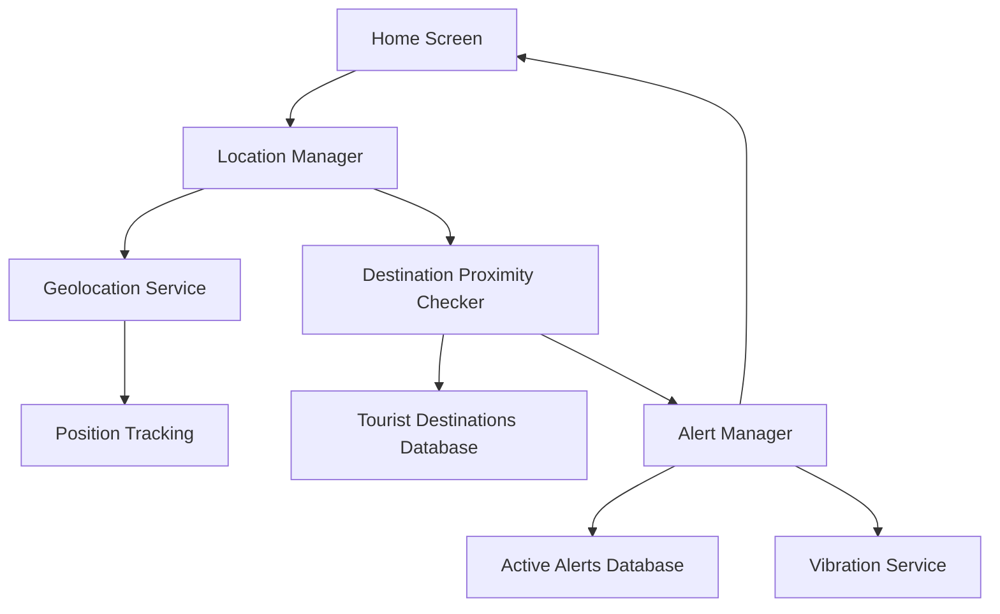
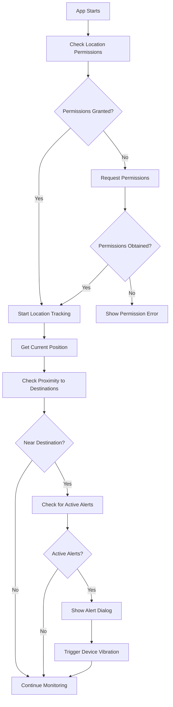

# Location-Based Alert System Design for AuTour Mobile App

## 1. Overview

### 1.1 Purpose
This document outlines the design for implementing a location-based alert system in the AuTour mobile application. The feature will show emergency alerts to users when they are near tourist destinations in Aurora Province and there are active weather or safety alerts for those locations.

### 1.2 Scope
The feature will:
- Monitor user location in real-time
- Determine proximity to tourist destinations in Aurora Province
- Check for active alerts related to nearby destinations
- Display emergency alerts with vibration feedback
- Integrate with the existing home screen UI

### 1.3 Target Users
- Tourists visiting Aurora Province
- Local residents using the app for tourism information
- Emergency response personnel monitoring tourist safety

## 2. System Architecture

### 2.1 Component Overview
The location-based alert system consists of the following components:



### 2.2 Key Components

#### 2.2.1 Location Manager
- Handles geolocation permissions and services
- Tracks user position periodically
- Integrates with existing location infrastructure in the app

#### 2.2.2 Destination Proximity Checker
- Calculates distance between user and tourist destinations
- Determines when user is within alert radius of a destination
- Triggers alert checks for nearby destinations

#### 2.2.3 Alert Manager
- Retrieves active alerts for nearby destinations
- Evaluates alert severity and relevance
- Triggers UI alerts and device vibration
- Manages alert display logic

#### 2.2.4 Data Sources
- Tourist destinations database (static data)
- Active alerts database (dynamic data from Firebase)

## 3. Data Models

### 3.1 Tourist Destinations Model
```dart
class TouristDestination {
  final String name;
  final String municipality;
  final double latitude;
  final double longitude;
  final String description;
  final List<String> activities;
  final String hours;
  final String fees;
  final List<String> tips;
}
```

### 3.2 Tourist Activities Model
```dart
class TouristActivity {
  final String name;
  final IconData icon;
  final Color color;
  final List<String> locations;
  final String riskLevel; // High, Medium, Low
  final List<String> alerts;
  final List<ActiveAlert> activeAlerts;
}
```

### 3.3 Active Alert Model
```dart
class ActiveAlert {
  final String type; // Weather, Trail, Safety, Tide
  final String message;
  final String severity; // High, Medium, Low
  final String time; // Timestamp
}
```

## 4. Feature Workflow

### 4.1 Location Monitoring Flow


### 4.2 Alert Display Logic
1. When user is within defined radius of a tourist destination
2. System checks for active alerts associated with that destination
3. If active alerts exist, display alert dialog with vibration feedback
4. Vibration intensity based on alert severity (High > Medium > Low)

## 5. Implementation Details

### 5.1 Location Services Integration
The app already has location services implemented using the `geolocator` package:
- Location permission handling
- Position tracking every minute
- Firebase integration for storing user locations

### 5.2 Proximity Calculation
- Use Haversine formula to calculate distance between user and destinations
- Alert radius: 2km for beaches, 1km for hiking trails, 500m for other locations
- Efficient filtering to avoid checking all destinations on each location update

### 5.3 Alert Data Structure
Based on the provided data, alerts will be structured as:
```json
{
  "activities": [
    {
      "name": "Surfing (Baler)",
      "icon": "surfing",
      "color": "blue",
      "locations": ["Sabang Beach - Baler", "Cemento Reef - Baler"],
      "risk_level": "High",
      "alerts": [
        "Check swell, wind, and typhoon advisories before paddling out.",
        "Beware of rip currents; if caught, swim parallel to shore to escape."
      ],
      "active_alerts": [
        {
          "type": "Weather",
          "message": "Strong onshore winds and rips reported at Sabang Beach",
          "severity": "Medium",
          "time": "2 hours ago"
        }
      ]
    }
  ],
  "destinations": [
    {
      "name": "Sabang Beach",
      "municipality": "Baler",
      "lat": 15.7580,
      "lng": 121.5660,
      "description": "Baler's iconic surfing spot",
      "activities": ["Surfing", "Swimming", "Sunrise/Sunset"],
      "hours": "Open 24/7",
      "fees": "Free (parking/cottage fees may apply)",
      "tips": [
        "Beginners should surf near designated areas with instructors.",
        "Beware of rip currents; check local advisories."
      ]
    }
  ]
}
```

### 5.4 Vibration Implementation
- Add `vibration` package dependency to pubspec.yaml
- Implement different vibration patterns for different alert severities:
  - High: Long vibration (1000ms) followed by short pause (500ms) repeated 3 times
  - Medium: Medium vibration (500ms) followed by short pause (500ms) repeated 2 times
  - Low: Short vibration (250ms) once

### 5.5 Alert Dialog UI
The alert dialog will include:
- Destination/activity icon and name
- Alert severity indicator (color-coded)
- Alert message
- Alert timestamp
- Action buttons (Dismiss, View Details)

## 6. Integration Points

### 6.1 Home Screen Integration
- Add alert checking to existing location update cycle
- Display alerts as modal dialogs on home screen
- Maintain existing UI animations and styling

### 6.2 Firebase Integration
- Store active alerts in Firebase Firestore
- Structure alerts by destination/activity
- Implement real-time listeners for alert updates

### 6.3 Existing Components
- Reuse existing dialog components and styling
- Leverage current location permission handling
- Integrate with existing color scheme and typography

## 7. Performance Considerations

### 7.1 Location Tracking
- Optimize location update frequency (every 1-2 minutes)
- Implement efficient proximity checking algorithm
- Cache destination data to minimize database reads

### 7.2 Alert Processing
- Filter destinations based on user's general location in Aurora Province
- Only check for alerts when user is near known destinations
- Debounce alert notifications to prevent spam

## 8. Error Handling

### 8.1 Location Services
- Handle cases where location is disabled
- Manage location permission denials gracefully
- Provide informative error messages to users

### 8.2 Alert System
- Handle network connectivity issues
- Implement fallback for alert data retrieval
- Manage cases where no alerts are found

## 9. Testing Strategy

### 9.1 Unit Tests
- Test proximity calculation algorithms
- Verify alert filtering logic
- Validate vibration pattern implementations

### 9.2 Integration Tests
- Test location permission flows
- Verify alert display functionality
- Check Firebase data retrieval

### 9.3 UI Tests
- Test alert dialog appearance and behavior
- Verify styling consistency with existing UI
- Check responsiveness across device sizes

## 10. Future Enhancements

### 10.1 Push Notifications
- Implement background alert notifications
- Send alerts even when app is not active

### 10.2 Weather Integration
- Connect with weather APIs for real-time conditions
- Implement predictive alerting based on forecast data

### 10.3 Multi-language Support
- Translate alerts to local dialects (Tagalog, Kapampangan, Ilongot)
- Implement language preference settings